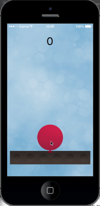
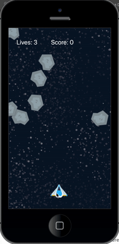

# Corona and Lua Tutorials

I'm taking some time to learn Corona and Lua. This repo is for tutorials from https://docs.coronalabs.com/guide/programming/index.html

## Chapter 1: Balloon Tap

## Chapter 2 & 3: Star Explorer

